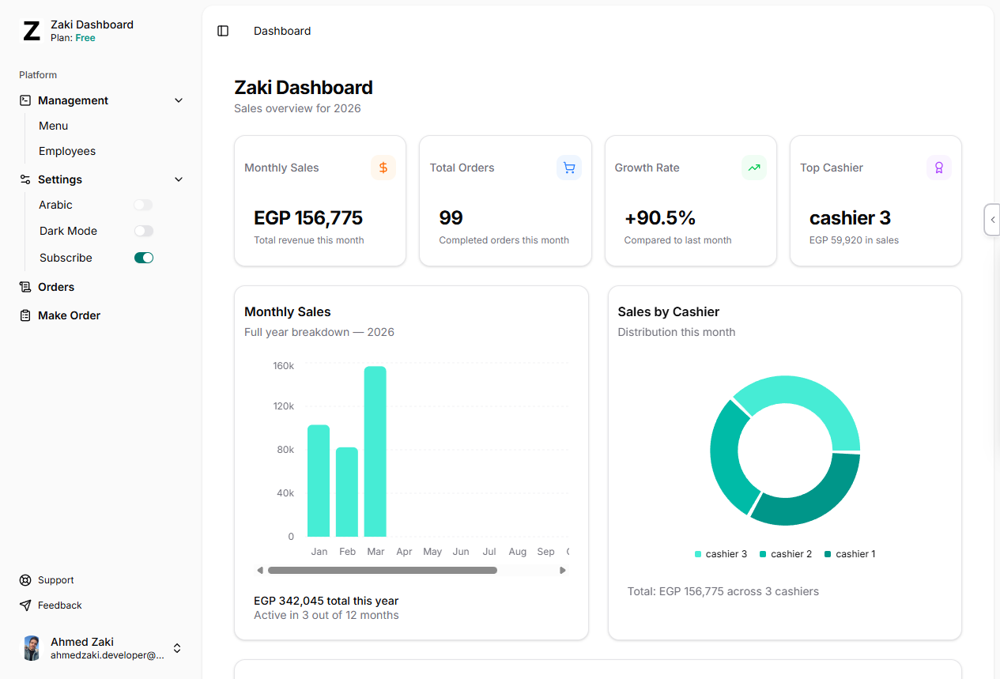
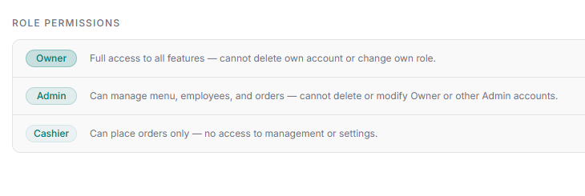
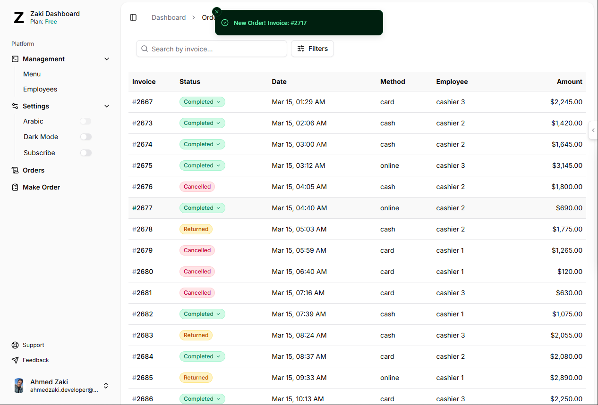
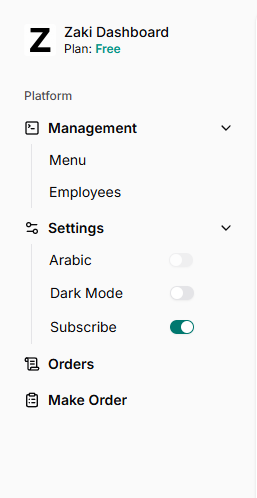
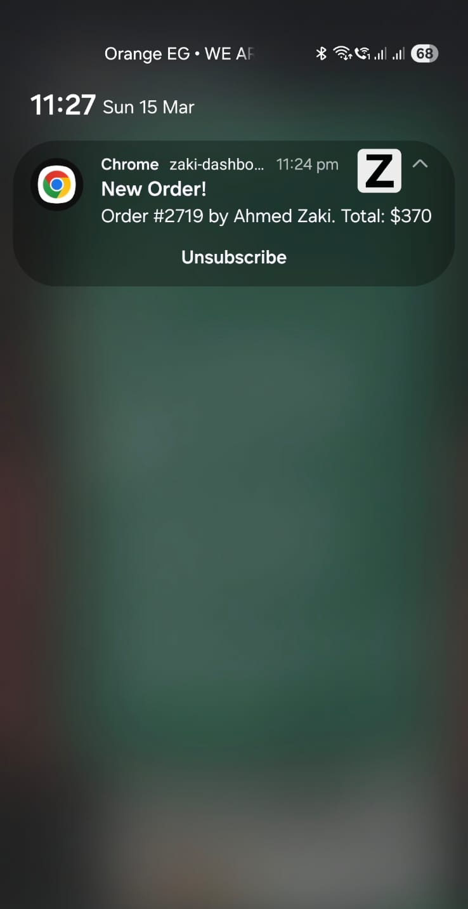
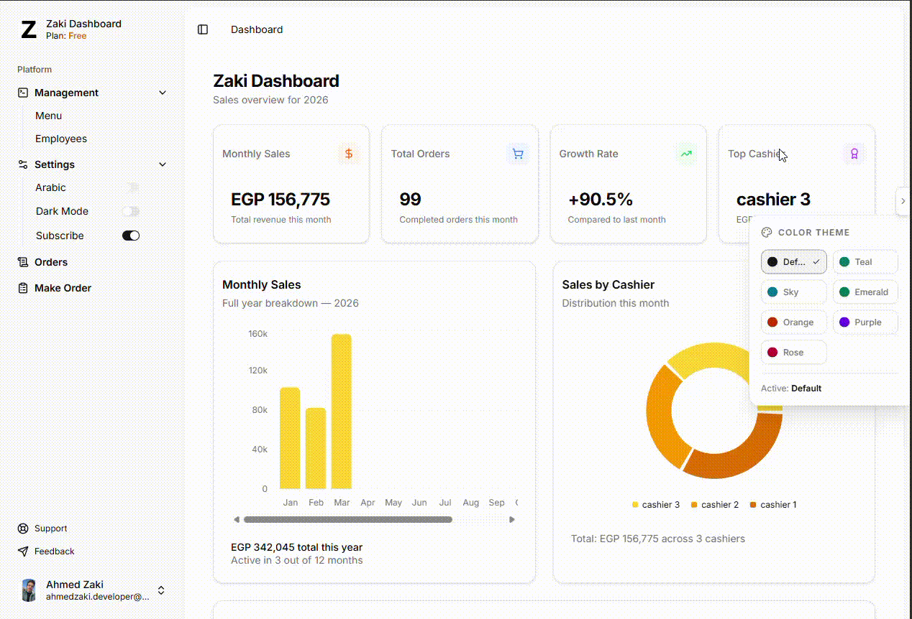
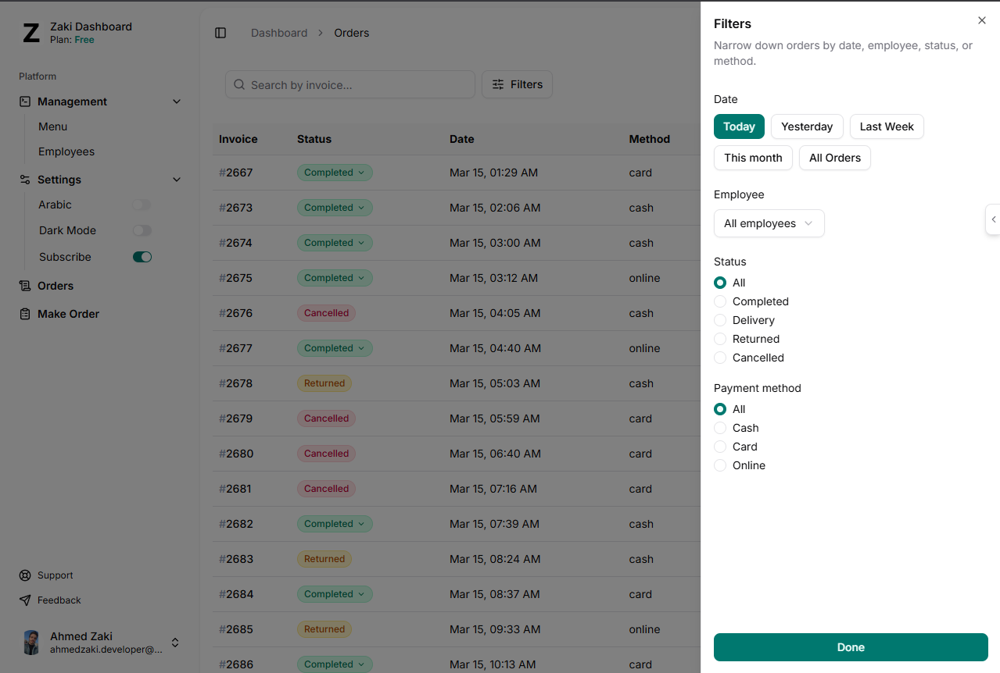

# Zaki Dashboard

> Live Demo · https://zaki-dashboard.vercel.app



## Enterprise Restaurant Management Dashboard

A high-performance, real-time administrative solution built with **React 19**, **Vite 7**, and **Supabase**. This dashboard provides a comprehensive suite for managing restaurant operations, featuring granular access control, real-time synchronization, and advanced data filtering.

---

## Key Features

### 🔐 Robust Authentication & RBAC

Leveraging **Supabase Auth** for secure session management. The system implements a strict **Role-Based Access Control (RBAC)** architecture:

- **Owner:** Full system access, financial overviews, and employee management.
- **Admin:** Operational control over menus and order processing.
- **Cashier:** Streamlined interface focused on order creation and real-time tracking.

> 

### ⚡ Real-time Synchronization

- **Live Order Tracking:** Powered by **Supabase Realtime**, ensuring the kitchen and front-of-house are always in sync without manual refreshes.
- **In-app Notifications:** Instant feedback via **Sonner** toasts for status changes or new incoming orders.

> 

### 🔔 Enterprise Push Notifications

Integrated with **OneSignal** to provide critical updates to Owners and Admins.

- Users can toggle notification preferences directly from the sidebar.
- Persistent state management for notification settings.
<div width="100%" > 
 
 
</div>

### 🎨 Advanced Theming Engine

A highly customizable UI built with **Tailwind CSS 4** and **Radix UI**:

- **Adaptive Modes:** Full support for Light, Dark, and System preferences.
- **Theme Persistence:** Multiple professional color schemes that persist across sessions using Local Storage.

  > 

### 📊 Order Management & Analytics

A sophisticated management module including:

- **Deep Filtering:** Filter datasets by timestamp, assigned employee, order status, and payment method.
- **Global Search:** Instant lookup via Invoice Number.
- **Data Visualization:** Visual performance metrics using **Recharts**.

  > 

---

## Tech Stack

| Category               | Technology                          |
| :--------------------- | :---------------------------------- |
| **Frontend Framework** | React 19 (Vite 7)                   |
| **Routing**            | React Router 7                      |
| **Backend / Database** | Supabase (PostgreSQL)               |
| **State Management**   | TanStack Query (React Query)        |
| **Styling**            | Tailwind CSS 4, Shadcn UI, Radix UI |
| **Forms & Validation** | React Hook Form + Zod               |
| **Notifications**      | OneSignal                           |
| **Charts**             | Recharts                            |

---

## Technical Highlights

The application utilizes a modular routing structure and optimized data fetching patterns:

- **Loaders & Hydration:** Pre-fetching data using React Router loaders to eliminate layout shifts and improve perceived performance.
- **Optimized Fallbacks:** Custom skeleton loaders (`MenuFallback`, `OrderFallback`) for a seamless UX during data transitions.
- **Performance Optimization:** Image compression via `browser-image-compression` for efficient menu management and asset handling.

---

## Getting Started

### Prerequisites

- Node.js (Latest LTS)
- Supabase Account & Project URL
- OneSignal App ID

### Installation

1.  **Clone the repository:**

    ```bash
    git clone https://github.com/ahmedzaki-me/Zaki-Dashboard.git
    cd Zaki-Dashboard
    ```

2.  **Install dependencies:**

    ```bash
    npm install
    ```

3.  **Configure Environment Variables:**
    Create a `.env` file in the root directory:

    ```env
    VITE_SUPABASE_URL=your_project_url
    VITE_SUPABASE_PUBLISHABLE_DEFAULT_KEY=your_anon_key
    VITE_ONESIGNAL_APP_ID=your_onesignal_app_id
    ```

4.  **Launch the development server:**
    ```bash
    npm run dev
    ```

---

## Deployment

This project is optimized for deployment on modern edge platforms.

- Build command: `npm run build`
- Output directory: `dist/`

---
## 📬 Contact

**Ahmed Zaki** — Junior Front-End Developer

[](https://ahmedzaki.me)
[](https://linkedin.com/in/ahmedzaki-me)
[](https://github.com/ahmedzaki-me) 


## License

Distributed under the MIT License.
